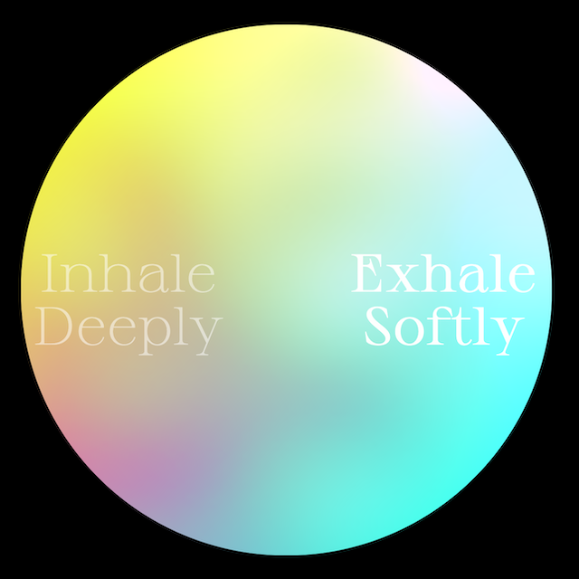

# Shaders for the web

---

#### Exercises & experiments with shaders using glsl.

---

1 - [Slow Breaths](https://johnalexanderberg.github.io/shadersfortheweb/01-slowbreaths/index.html).

2 - [Kaleidoscope](https://johnalexanderberg.github.io/shadersfortheweb/02-kaleidoscope/index.html).

---
